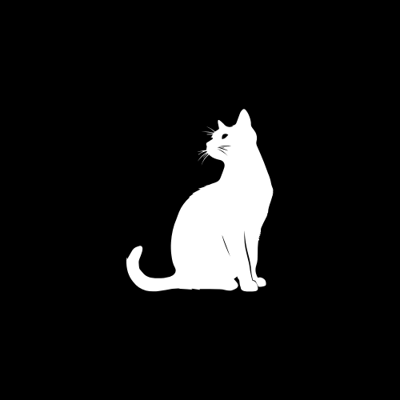

# Howlira

💬 Um simples webapp de chat para gamers

Inspirado pelo [WhoMessage](https://whomessage.chat)

## 🚀 Tecnologias usadas

- HTML
- Typescript
- Livekit Server SDK

## 📄 Licença
O Howlira está licenciado sob a **MIT License**.

É proibida a venda do software sem autorização do possuidor do software(Astro)

Feito com 💖 por Astro

